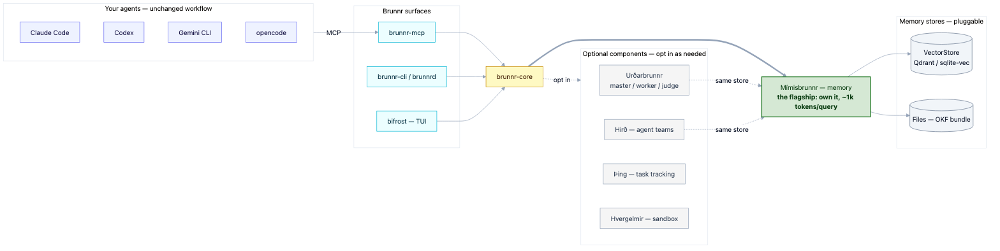

<!-- SPDX-License-Identifier: Apache-2.0 -->

# Brunnr

**Shared, durable memory for your AI agents — so a new session (or a different agent) starts with the
right context instead of re-reading everything.** Brunnr is a Rust workspace for multi-agent context
orchestration: a non-intrusive memory layer first, with optional master/worker/judge orchestration on
top. MCP-first, with pluggable agents and pluggable memory backends.

[](LICENSE)
&nbsp;status: bootstrap

[](docs/diagrams/system-map.mmd)

On our [retrieval benchmark](benchmarks/README.md), Brunnr holds per-query context cost at
**~1,000 tokens** while the memory grows into the hundreds of thousands of tokens — a realistic
multi-session history is already 100k+ tokens of accumulated reasoning, tool output, and messages.
Full-context replay grows with the history, so the saving rises from **93% to 99.8%** as memory
scales (13k → 478k tokens). See the [chart, tables, and methodology](benchmarks/README.md).

**What you get**

- **One shared memory** every agent and session reads at start — stop re-deriving the codebase or
  replaying whole markdown files each time.
- **Targeted recall, not replay** — a compact index slice plus a top-k retrieval slice instead of the
  whole context (the token saving above).
- **Optional orchestration** — master/worker/judge with hot-swappable agents (Claude Code, Codex,
  Gemini CLI, opencode), enabled only if you want it.
- **Non-intrusive, MCP-first** — your agent's workflow is unchanged; it just gains memory tools.

**New here?** [docs/onboarding.md](docs/onboarding.md) has a human Quickstart **and** an idempotent
AI-agent bring-up recipe (any agent — Codex, Claude Code, Gemini CLI, opencode — can deploy Brunnr
per your config and connect a project, non-destructively). Why Brunnr vs other memory tools:
[docs/positioning.md](docs/positioning.md).

## Status

This repository is in bootstrap. The working path is `memory` mode with local Files or SqliteVec backends, optional Qdrant integration, and an MCP server exposing `memory.find` and `memory.store`.

## Install

From crates source (installs the `brunnr` CLI and the `brunnrd` daemon):

```shell
cargo install --git https://github.com/principalwater/brunnr brunnr-cli
```

Then:

```shell
brunnr init                                   # detect agents, write config + MCP registration
brunnr memory store "Brunnr keeps durable context" --tag bootstrap
brunnr memory find durable
```

Signed release binaries, an `install.sh`, and a container image are planned for the first tagged
release (see [Status](#status)).

## Quickstart (from source)

```shell
cargo build --workspace
cargo run -p brunnr-cli -- init
cargo run -p brunnr-cli -- memory store "Brunnr keeps durable context" --tag bootstrap
cargo run -p brunnr-cli -- memory find durable
```

Initialize with the zero-infrastructure vector backend:

```shell
cargo run -p brunnr-cli -- init --backend sqlite-vec
```

Run the MCP server over stdio using the generated config:

```shell
cargo run -p brunnr-mcp -- --config brunnr.toml
```

Backfill markdown or JSON memories idempotently:

```shell
cargo run -p brunnr-cli -- backfill ./memory-export
```

Spawn role aliases are available in plain English and Norse form:

```shell
cargo run -p brunnr-cli -- spawn master claude-code
cargo run -p brunnr-cli -- spawn thor codex
cargo run -p brunnr-cli -- spawn tyr gemini
```

## Workspace

- `brunnr-core`: role, queue, config, and agent adapter traits.
- `mimisbrunnr`: memory trait, Files backend, generic vector memory backend, SqliteVec vector store, RRF seam, and feature-gated Qdrant vector store.
- `hvergelmir`: optional sandbox runtime seam.
- `bifrost`: future TUI crate.
- `brunnr-mcp`: MCP server for memory tools.
- `brunnr-cli`: CLI entrypoint.
- `brunnr-test-support`: shared helpers for crate-level integration tests.

## Modes

- `memory`: memory backend plus MCP tools, with no orchestration requirement.
- `orchestrate`: optional master, worker, judge role routing.
- `full`: memory, orchestration, and sandboxing.
- `advanced`: bring your own existing memory or context layout.

## License

Brunnr is licensed under Apache-2.0. Contributions must include a DCO sign-off.

## Development

Brunnr uses crate-level integration tests, shared test helpers, and repo-level tooling modeled on
mature Rust workspaces. See [docs/development.md](docs/development.md).

The public memory benchmark is in [benchmarks/README.md](benchmarks/README.md) and runs with
`just bench`.

## Acknowledgments

Brunnr stands on the shoulders of prior work and public ideas. Brunnr reuses ideas and APIs where appropriate, not third-party source code.

- **Andrej Karpathy — the "LLM wiki" pattern** — https://gist.github.com/karpathy/442a6bf555914893e9891c11519de94f (announced at https://x.com/karpathy/status/2039805659525644595) — the LLM-maintained markdown knowledge base (`index.md` catalog + `log.md` + entity/concept pages; ingest/query/lint) that directly informs Brunnr's Files/OKF backend and its consolidation roadmap.
- **Qdrant** — https://github.com/qdrant/qdrant (vector store; `QdrantBackend` via `QdrantVectorStore`).
- **TencentDB Agent Memory** — https://github.com/TencentCloud/TencentDB-Agent-Memory (L0–L3 tiering, hybrid BM25+vector RRF, node_id drill-down, sqlite-vec local-first; `SqliteVecBackend` + `TencentDBBackend`).
- **OpenAI — Codex Memories & Agent Loop** — https://developers.openai.com/codex/memories · https://openai.com/index/unrolling-the-codex-agent-loop/ (memory model + the agent loop).
- **Anthropic — Claude Code Agent Memory & Agent Loop** — https://platform.claude.com/docs/en/managed-agents/memory · https://code.claude.com/docs/en/agent-sdk/agent-loop (memory + the agent loop).
- **Open Knowledge Format (OKF)** — Google Cloud `knowledge-catalog` (Apache-2.0) — https://github.com/GoogleCloudPlatform/knowledge-catalog — the portable markdown+YAML knowledge-bundle format Brunnr's `files` memory backend aligns with.
- **ApX Machine Learning — Agentic LLM Systems & Memory Architectures** (course) — https://apxml.com/courses/agentic-llm-memory-architectures — an educational reference that helped frame our memory, retrieval, consolidation, planning, and multi-agent design. The underlying techniques are grounded in their **primary sources** (cited per-topic in `docs/`); ApX content is credited and linked, never reproduced.

- **h5i** — https://github.com/h5i-dev/h5i — an AI-aware Git sidecar (per-commit agent context,
  inter-agent messaging with union-merge, and progressive sandbox isolation). A complementary layer
  to Brunnr's semantic memory; its typed agent-handoff messaging informs Brunnr's orchestration
  handoff protocol, and its isolation tiers inform the `hvergelmir` sandbox direction.

Prior art also includes OpenAI Symphony, Cursor scaling-agents, and the self-correcting /
long-running coding-agent patterns (e.g. "Autonomous Long-Running Coding Agents"). All
acknowledgments are references to public ideas/APIs and link to the sources; no third-party
content is reproduced.
