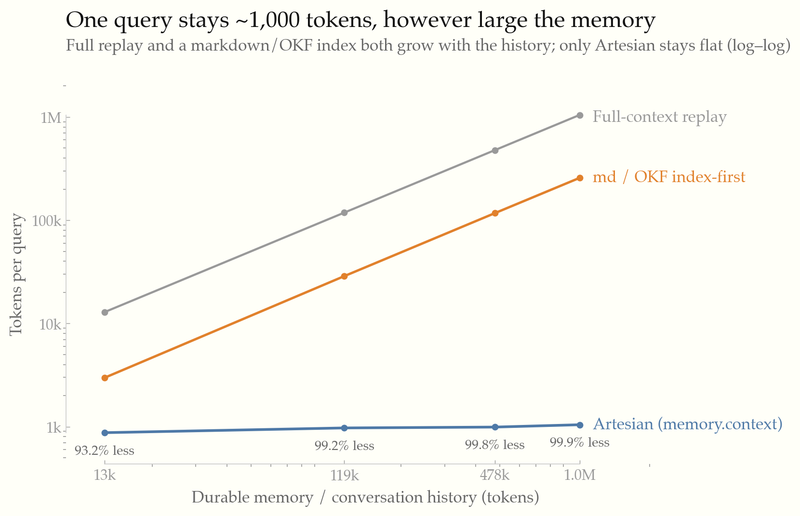

<!-- SPDX-License-Identifier: Apache-2.0 -->

# Artesian Retrieval Benchmark

This benchmark measures the question agent-memory systems are judged on: **as the durable memory (or
conversation history) grows, how many tokens does each query actually cost, and is the right context
still retrieved?** It follows the framing used by long-term-memory benchmarks such as LoCoMo and
LongMemEval — bounded retrieval versus full-context replay over realistically large histories — and
is fully reproducible (`just bench-check`).

## What this compares

The unit is **one query against a memory of a given size**. We measure how each strategy assembles
the context for that query:

- **Full-context replay** *(the baseline)* — paste the **entire** memory into the prompt every
  query. Cost = the whole memory's size (this is what an agent does when it just loads all its notes
  / history).
- **md / OKF, index-first** — load the full index (one line per file, like a `MEMORY.md`) plus the
  relevant whole file(s). Cheaper than replay because you skip loading every file's *content*, but
  the index itself still grows with the memory — so this line rises with size too, just lower.
- **Artesian** — a compact index slice plus a semantic top-k retrieval slice (`memory.context`),
  roughly constant in size regardless of how large the memory is.

**"Saving" is relative to full-context replay**: `(replay_tokens − strategy_tokens) / replay_tokens`.
So "99.2%" means Artesian's prompt is 99.2% smaller than dumping the whole 119k-token memory in. Two
things are reported: **token cost** (below) and **retrieval quality** — whether the strategy actually
fetches the document that holds the answer (precision / recall, in the [Retrieval quality](#retrieval-quality)
section).

## Headline

Artesian keeps per-query context cost roughly **constant (~1,000 tokens)** while the memory grows past a
**million tokens**. Full-context replay grows with the history and quickly becomes the dominant cost;
a realistic multi-session workload is already 100k+ tokens of accumulated reasoning, tool output, and
messages.



| Memory / history | Full-context replay | md/OKF index-first | Artesian (`memory.context`) | Artesian saving | Answer doc retrieved |
|---|---:|---:|---:|---:|---:|
| ~13k tokens (180 docs) | 12,902 | 2,983 | 876 | 93.2% | 100% |
| ~119k tokens (1,600 docs) | 118,566 | 28,757 | 974 | 99.2% | 100% |
| ~478k tokens (6,400 docs) | 477,740 | 117,159 | 992 | 99.8% | 100% |
| ~1M tokens (14,000 docs) | 1,046,431 | 257,131 | 1,046 | 99.9% | 100% |

Artesian sends a compact index slice plus a top-k retrieval slice regardless of how large the memory
is, so its per-query cost barely moves (876 → 1,046 tokens) while replay grows ~81× to over a million.
A plain markdown/OKF index helps a lot (~75% off replay) but **still grows with the memory** (2,983 →
257,131) because the index lists every file — only Artesian stays flat. This is the same property memory
systems like Mem0 report (near-constant tokens per query as history scales); here it is measured
end-to-end against the real retrieval path. Answer-document retrieval stays at **100% across every
tier**, including the ~1M-token / 14,000-document mega tier, at ~1,046 tokens per query — recall
holds while per-query cost stays flat. Every tier is reproducible byte-for-byte across runs: the
harness isolates its per-process lane locks, so concurrent or restarted runs cannot perturb the
numbers.

## Large-source retrieval: small-to-big expansion

When each memory document is several KB (real-world multi-section markdown), a keyword query often
hits a single chunk in the wrong section. **Small-to-big retrieval** solves this: each chunk match
is expanded to its surrounding parent-section context — sibling chunks merged up to an adaptive
budget (`parent_context_max_chars` = 8192 chars), bounded so one large document never consumes the
whole context window.

The `large-source-run` tier proves this with six ~6 KB decision documents (answer buried
mid-document) against full-replay and Artesian default:

| Strategy | Tokens/query | Success | Bounded? |
|---|---:|---:|---:|
| Full-context replay | 9,067 | 100% | — (entire corpus) |
| **Artesian default (small-to-big)** | **713** | **100%** | ✓ (≤ 8,192 chars/hit) |

Artesian returns a coherent parent-section window (**12.7× cheaper** than full-replay) while full-replay
grows linearly with document size. Token accounting uses the full expanded content — not a 500-char
preview — so these numbers reflect the real context cost an agent pays.

`aggregate.json` for large-source-run includes `large_source_assertions` (one entry per task for the
B-default-artesian arm) reporting:
- `bounded_ok` — fatal if any hit exceeds 8,192 chars; always passes when small-to-big is working.
- `expansion_proven` — fatal if the retrieved relevant-doc hit is ≤ 500 chars; proves expansion fired.
- `coherence_ok` — informational; true when the expanded window happens to contain the buried answer
  sentence. The query may match a non-answer section of the relevant doc, so this can be false even
  when retrieval is correct.

## Methodology

The harness indexes a corpus's `memory/` and `distractors/` directories through the real
`aquifer::backfill_directory` path into `SqliteVecVectorStore`, then calls `VectorMemoryBackend.find`
for each retrieval strategy. The retriever sees one undifferentiated corpus; `tasks.json`
`relevant_docs` is used only *after* retrieval, to score precision and recall. A task succeeds when
its relevant source document is in the retrieved set. Token accounting uses the **full retrieved
content** (after any small-to-big expansion), not a 500-char display preview — so reported tokens
reflect the actual context cost an agent would pay.

Three families of corpora run the identical harness:

- **Scaling** (procedural, deterministic — `tools/generate_corpus.py`): `xl` (~13k), `session`
  (~119k), `mid` (~478k tokens). Each doc is a distinct fact, so these isolate the cost-vs-size
  curve above.
- **Retrieval quality** (hand-authored prose with plausible near-miss distractors): `seed` (13 docs)
  and `large` (41 docs), where retrieval is genuinely hard and recall can drop — see below.
- **Large-source** (six ~6 KB decision documents, answer buried mid-doc): proves small-to-big
  expansion returns a bounded coherent window rather than a 500-char fragment.

Assumptions: backend `SqliteVecVectorStore`; embedding `intfloat/multilingual-e5-small` (384-d);
hybrid SQLite-FTS/BM25 + dense search fused with RRF, then a local lexical reranker where enabled;
tokenizer `cl100k_base` via `tiktoken-rs`.

## Retrieval quality

Sending less context is only useful if the answer is still in it. This table asks: when a strategy
does **not** include everything, does it still fetch the document that holds the answer? (Full replay
is 100% by definition — it includes everything — at the token cost shown above.) Where documents are
semantically confusable (the `large` tier), this is a real trade-off:

| Strategy | Success | Tokens/query | Precision | Recall |
|---|---:|---:|---:|---:|
| Full replay | 100% | 2,988 | 0.02 | 1.00 |
| **Artesian default** | 80% | 861 | 0.27 | 0.80 |
| Artesian + reflection | 95% | 1,059 | 0.32 | 0.95 |
| Artesian + multi-query | 55% | 905 | 0.18 | 0.55 |
| Artesian + HyDE | 45% | 909 | 0.15 | 0.45 |
| Built-in memory (top-1) | 75% | 120 | 0.75 | 0.75 |
| No memory | 0% | 52 | 0.00 | 0.00 |

Artesian's default cuts tokens while recovering the answer document in most tasks; a larger or more
confusable corpus lowers recall (the trade-off Artesian manages). Opt-in methods stay **off by
default** — they do not help here, and a weak strategy (HyDE) genuinely fails — enable one only if a
target corpus shows a measured gain. `Tokens/query` is the context cost; `tokens/success` (in the
raw results) additionally penalizes lower success.

## Reproduce

```sh
just bench                # seed (retrieval quality)
just bench-large          # large (retrieval quality)
just bench-xl             # xl    (~13k scaling)
just bench-session        # session (~119k scaling)
just bench-mid            # mid   (~478k scaling)
just bench-large-source   # large-source (small-to-big + bounded recall)
just bench-check          # rerun all tiers and fail if committed results differ
python3 benchmarks/tools/plot_scaling.py   # regenerate results/scaling.svg
```

Procedural corpora regenerate deterministically with
`python3 benchmarks/tools/generate_corpus.py --out <tier> --docs N --tasks T`. The large-source
corpus regenerates with `python3 benchmarks/tools/generate_large_source_corpus.py`. A live-Qdrant
smoke proves the same retrieval path against `QdrantVectorStore`:
`cargo test -p artesian-bench --test qdrant -- --ignored` with `QDRANT_URL` set. Each tier keeps small,
byte-reproducible artifacts (`aggregate.json`, `summary.csv`, `charts.txt`, `checksums.txt`); the
bulky `raw.jsonl` and machine-dependent `timing.jsonl` are gitignored.

## Reproducibility and integrity

1. `tasks.json` `relevant_docs` is the ground truth and is never passed to the retriever; precision
   and recall are scored only against what `memory.find` returns.
2. Retrieval arms call `MemoryBackend.find` (`crates/artesian-bench/src/main.rs`) — there are no
   hardcoded, label-derived result sets.
3. `just bench-check` reruns every tier and fails if any committed result changes; `aggregate.json`
   records the per-tier retrieval misses, so weak strategies are visible rather than hidden.

## Scope

This measures retrieval quality and tokenizer footprint, not end-to-end answer quality. Artesian helps
when a bounded retrieval slice can surface the answer source from a larger durable context; it does
not help if the query is underspecified, the corpus lacks the answer, or the host agent already
retrieves the right document cheaply.
