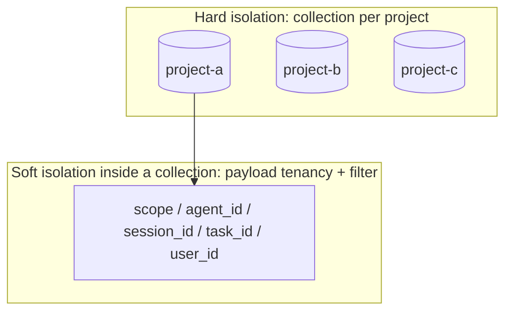
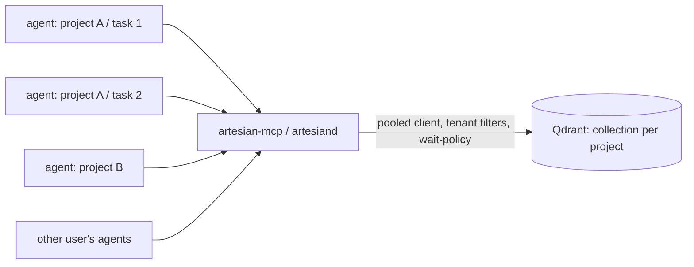

<!-- SPDX-License-Identifier: Apache-2.0 -->

# Concurrency & Multi-Tenancy (vector memory)

Artesian must hold up under real parallelism: many agents across **different projects**, many agents
on the **same project** doing **different tasks**, and **multiple users** hitting the shared vector
memory at once. This doc states the data model and operational rules that make that safe.

## Why the model is concurrency-friendly by construction

The memory model is **append-mostly and idempotent**, which removes the classic race before it
starts:

- **Idempotent writes.** A record's id is a content hash (`stable_memory_id`); `store` short-
  circuits if the id exists. Two agents storing the *same* learning converge to one point; two
  agents storing *different* learnings create independent points. There is **no read-modify-write
  on a point**, so there are no lost updates. A large record is stored as several **chunk** points,
  each independently content-hashed, so chunking keeps the same per-point idempotency.
- **Lock-free reads.** `find` is pure retrieval; concurrent searches never block each other.
- **Isolated units.** Each memory is its own point; concurrency is "many independent inserts +
  many independent reads", the workload vector stores are built for.

So the design question is not "how do we lock", but "how do we **isolate tenants** and **handle the
few non-idempotent operations**".

## Isolation levels (choose per need)



1. **Project = collection (hard).** Different projects are different collections; cross-project
   leakage is impossible. Multiple agents on different projects never contend on the same
   collection.
2. **Within a project = payload tenancy (soft, filtered).** Many agents/tasks/users share one
   project collection and are separated by indexed payload fields, queried with the normalized
   `Filter`:
   - `scope`: `shared` | `agent` | `session` | `task` (visibility class),
   - `agent_id`, `session_id`, `task_id`, `user_id` (owners).
   `shared` knowledge is visible to all workers on the project; `session`/`task` scope keeps an
   agent's scratch from polluting others. On Qdrant, index the tenant field with `is_tenant: true`
   for multi-tenant storage layout + fast filtering.
3. **Strict per-user (optional).** If users must never see each other's data, give each a
   collection (`<project>__<user>`); same trait, just more collections.

**Agent teams (Wellfield)** are the canonical "many agents on one project" case: teammates share the
project collection and read each other's `shared` knowledge, while their `agent`/`task` owners keep
per-teammate scratch isolated — so a team coordinates over one memory without cross-contamination.
See [teams.md](teams.md).

The `VectorStore` trait already carries a `Filter`; tenancy is a **convention on payload + filter**,
not a new API. `StoreMemory`/`MemoryQuery` gain an optional `scope`/owner set that maps to payload
on write and to a filter on read.

## Backend by concurrency level

| Backend | Concurrent readers | Concurrent writers | Multi-user | Use when |
|---|---|---|---|---|
| `qdrant` | native | native | yes (server + API keys) | **many agents / many users / parallel** |
| `sqlite-vec` | yes (WAL) | **serialized** | single-host | one machine, low write concurrency |
| `files` (OKF) | yes | one writer (atomic write) | single-host | zero-infra, personal |

**Rule:** the multi-agent / multi-user / parallel workload the operator described is a **Qdrant**
(server-backed) deployment. `sqlite-vec` and `files` are single-host, low-concurrency backends.

## Operational rules

- **Qdrant**
  - Concurrent reads/writes to one collection are native; no app-level locking needed.
  - **Read-after-write:** when an agent must immediately retrieve what it just wrote, upsert with
    `wait=true` (apply before returning); otherwise default async for throughput.
  - **Connection funneling:** local agents reach Qdrant **through `artesian-mcp` / `artesiand`**, which
    owns a pooled client — many agents, controlled connections. Per-user/tenant **API keys** for
    multi-user deployments.
  - Index tenancy + frequently-filtered fields; keep payload lean.
- **sqlite-vec (single host)**
  - Opens in **WAL mode** with a `busy_timeout`; WAL gives concurrent readers + one writer.
  - **Serialize writers through one process** (the `artesiand` daemon) so multiple local agents don't
    collide; readers may open the file directly. Per-project file = per-project lock.
- **The few non-idempotent ops** (consolidation/dedup merges, redundancy pruning) run as a
  **single async job** (one writer), or use Qdrant optimistic concurrency — never concurrently from
  many agents. The session anchor (Anchor) is per-session, so it never contends.

## Session lanes

Writes are serialized per `(collection, session_id)` lane with a process-aware lock file. A missing
`session_id` maps to the `shared` lane for that collection. The lock is acquired with atomic
`create_new`, records only non-secret metadata (`pid`, `lane`, timestamp), removes stale locks whose
owner process is gone, and fails with a bounded timeout instead of waiting forever. Reads do not
take lane locks.

This is the OpenClaw-style "session lane" rule in Artesian terms: independent sessions can write in
parallel, but a single session's append stream is ordered so two concurrent runs cannot interleave
destructively. The lock directory defaults to `.artesian/locks` and can be overridden with
`ARTESIAN_LANE_LOCK_DIR`.

## Access funnel



Routing every agent through the MCP server / daemon centralizes connection pooling, the
read-after-write policy, tenant filtering, and (optionally) auth — so adding agents or users scales
without each one managing raw DB connections.

## Transactional commit log (optimistic concurrency)

The `TransactionalMemory<B>` wrapper in `aquifer::txn` adds an explicit, application-visible
optimistic-concurrency layer on top of any `MemoryBackend`:

1. **Read free.** `current_seq()` is a lock-free atomic read.
2. **Write CAS.** `begin_write()` snapshots the current sequence; `commit(expected_seq, memory)`
   succeeds only if the sequence is still `expected_seq` — otherwise returns
   `TxnError::Conflict { expected, actual }` so the caller can retry with a fresh read.
3. **`commit_with_retry(memory, max_retries)`** wraps the CAS loop automatically.

This is the optimistic-concurrency model Cursor documented: "read free, write fails if state
changed." It does NOT replace the underlying backend's own serialization (SQLite WAL / Qdrant
native concurrency) — it adds an explicit, logic-level CAS so agents can reason about "what
sequence was the world in when I started this write?"

**OKF file edits as transactions.** `aquifer::sync_okf_directory(dir, backend)` re-indexes
every OKF markdown file in a directory. Run it after a human edits a file and the new content is
immediately retrievable. A file-watcher daemon calls this at configurable cadence — the edit is
a first-class transaction, not a side-channel.

**Acceptance test (Step 4).** `concurrency.rs::transactional_memory_n_agents_m_operators_zero_corruption`
spawns 6 agents × 4 operators = 24 concurrent writers through one `TransactionalMemory`. All 24
commits succeed via `commit_with_retry`; the commit log advances to exactly 24; tenant-filtered
reads return exactly 6 memories per operator — zero corruption, correct isolation. The
Oracle/Cursor failure mode does not occur.

## Summary

- Append-mostly + idempotent writes ⇒ no lost-update races.
- Hard isolation by project-collection; soft multi-tenancy by indexed payload + filter; optional
  per-user collections.
- `StoreMemory`/`MemoryQuery` carry optional `scope`, `agent_id`, `session_id`, `task_id`, and
  `user_id`; vector backends receive these as normalized payload filters, without changing
  `VectorStore`.
- Session-lane locks serialize writes per collection/session with bounded timeouts; reads remain
  concurrent.
- `TransactionalMemory<B>` adds optimistic CAS (read free, write fails on conflict) over any
  backend. `sync_okf_directory` makes file edits first-class transactions.
- Qdrant for parallel/multi-user; sqlite-vec/files for single-host.
- Funnel access through `artesian-mcp`/`artesiand` for pooling, `wait=true` read-after-write, tenant
  filtering, and per-user keys.

## Container model

The repository includes a multi-stage `Dockerfile` that builds the `artesian` and `artesiand` binaries
and copies only those binaries into a minimal Debian trixie runtime image. The trixie base keeps
the glibc/libstdc++ runtime new enough for the fastembed/ONNX Runtime dependency used by vector
backends. Build it with:

```shell
docker build -t artesian:local .
```

Run `artesiand` against an external Qdrant by mounting config/data and passing credentials through
the runtime environment or an orchestrator secret store:

```shell
docker run --rm \
  -v "$PWD/.artesian:/data" \
  -e QDRANT_URL=http://qdrant.example:6333 \
  -e QDRANT_REST_URL=http://qdrant.example:6333 \
  artesian:local --config /data/artesian.toml --root /data
```

No provider secrets are baked into the image. Spawned agent CLIs are also outside the image by
default: either mount the specific CLI and its credential/config directory into the container, or
run orchestration on the host and use the container only for `artesiand`/memory. The optional
`deploy/artesian/compose.yml` starts Artesian with a local Qdrant for development.
