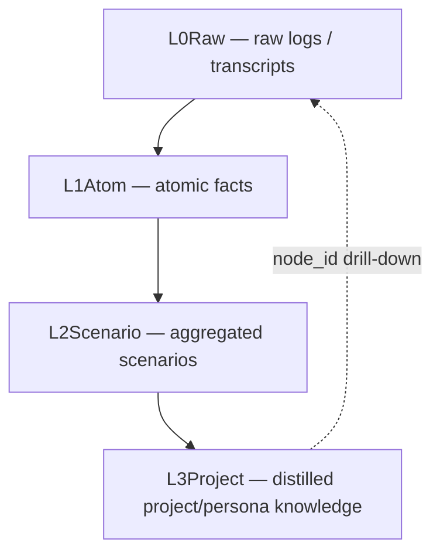
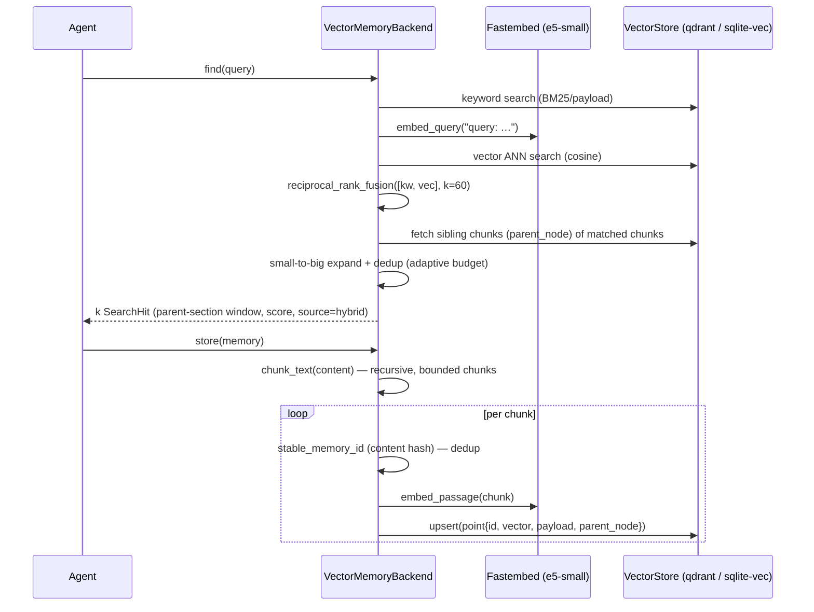
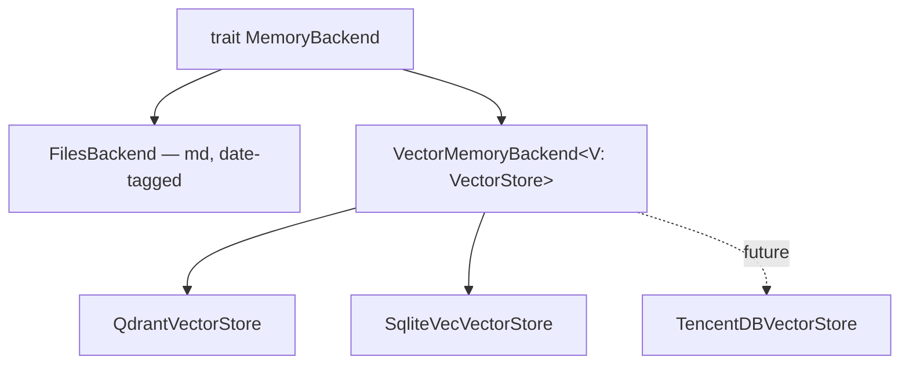
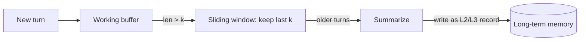
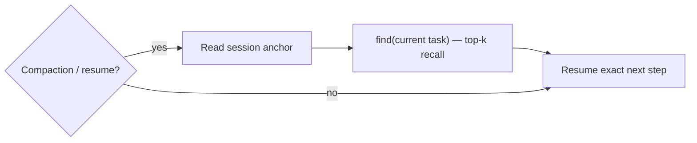

<!-- SPDX-License-Identifier: Apache-2.0 -->

# Mímisbrunnr — Brunnr Memory Architecture

> *Mímisbrunnr is the well of wisdom at the root of Yggdrasil. Brunnr's memory subsystem is the
> well your agents drink from before they act.*

This document describes how Brunnr models, stores, and retrieves agent memory: the taxonomy
(short-term vs long-term), the concrete data model, the retrieval mathematics as actually
implemented, the pluggable backend seam, and the self-repair mechanism that survives context
auto-compaction. Formulas here match the code; each section links to the implementing file.

Status legend: **[implemented]** = present in `crates/mimisbrunnr`; **[planned]** = designed,
not yet built (tracked in the roadmap).

---

## 1. Why memory

An LLM call is stateless: the model only sees its context window of size $L_{context}$. Two
pressures follow for any agent that runs longer than one prompt:

1. **Recall beyond $L_{context}$** — facts, decisions, and past work exceed the window.
2. **Token economy** — replaying whole project docs into every session is expensive and
   crowds out reasoning budget.

Brunnr's thesis: replace *replaying everything* with *retrieving only what is relevant*. A
targeted recall of a few hundred tokens substitutes for thousands of tokens of re-read context,
which is both cheaper and more focused. This is the same lever the Brunnr project itself was
created to pull.

[](diagrams/memory-overview.mmd)

> **Design principle — cheap by default, smart on demand.** The default memory path is local:
> structural import, an `index.md` catalog, embedding retrieval, RRF, and a local reranker seam
> where enabled. It makes no extra LLM calls and adds zero provider tokens. Every sophistication
> that costs an LLM call (HyDE, LLM multi-query, reflection consolidation, debate/critique) is
> **opt-in** and **off by default**, so "memory mode" never changes how you drive your agent — it
> only makes it cheaper and sharper.

---

## 2. Taxonomy and data model

Brunnr follows the standard agent-memory split (short-term working memory vs long-term
persistent memory; see references) and layers a TencentDB-style tiering over long-term records.

Every long-term unit is a `MemoryRecord` (`crates/mimisbrunnr/src/types.rs`):

| Field | Meaning |
|---|---|
| `id` | content-derived stable id (dedup key) |
| `node_id` | deterministic handle for drill-down from a summary to ground truth |
| `content` | the embedded text |
| `tags`, `metadata` | filterable payload (incl. tenancy: `scope`/`agent_id`/`session_id`/`task_id`/`user_id` — see [concurrency.md](concurrency.md)) |
| `tier` | `L0Raw` \| `L1Atom` \| `L2Scenario` \| `L3Project` |
| `created_at` | timestamp (date-tagged on disk) |

**Memory tiers** (`MemoryTier`) implement progressive abstraction so high-level summaries stay
traceable to evidence:



A consumer asks at a high tier (cheap, dense) and uses `get_node(node_id)` to pull the exact
ground-truth record only when needed — "context offloading" that keeps prompts small.

---

## 3. Long-term memory — semantics and math [implemented]

### 3.1 Embeddings

Text is embedded into a dense vector $e = f(\text{text})$ with a pinned model so vectors are
comparable across every machine and backend
(`crates/mimisbrunnr/src/vector_memory.rs`):

- model `intfloat/multilingual-e5-small`, $d = 384$ dimensions, multilingual (RU/EN);
- E5 requires asymmetric prefixes — Brunnr embeds queries as `query: …` and stored passages as
  `passage: …` (`FastembedTextEmbedder::embed_query` / `embed_passage`). Skipping the prefixes
  measurably degrades E5 recall, so this is enforced in one place.

### 3.2 Semantic similarity

Relevance between a query embedding $q$ and a record embedding $d$ is cosine similarity (the
configured `Distance::Cosine`):

```math
\mathrm{sim}(q, d) = \cos\theta = \frac{q \cdot d}{\lVert q\rVert\,\lVert d\rVert}
= \frac{\sum_{i=1}^{384} q_i d_i}{\sqrt{\sum_{i=1}^{384} q_i^2}\,\sqrt{\sum_{i=1}^{384} d_i^2}}
```

Range $[-1, 1]$; higher means more semantically related. The vector store performs **approximate
nearest-neighbour (ANN)** search to return the top-$k$ records by this metric without scanning
every point — single-digit milliseconds at Brunnr's scale.

### 3.3 Hybrid retrieval via Reciprocal Rank Fusion

Pure vector search misses exact tokens (identifiers, error codes); pure keyword search misses
paraphrase. Brunnr runs **both channels** and fuses them with Reciprocal Rank Fusion
(`crates/mimisbrunnr/src/rrf.rs`). For a document $d$ appearing at rank $r_c(d)$ (1-based) in
channel $c$:

```math
\mathrm{RRF}(d) = \sum_{c \in \{\text{keyword},\,\text{vector}\}} \frac{1}{k + r_c(d)},
\qquad k = 60
```

The code computes `1.0 / (rank_constant + rank + 1.0)` with 0-based `rank` and
`rank_constant = 60` (`RrfOptions::default`, `types.rs`), i.e. exactly $1/(k + r_c)$ with 1-based
$r_c$. Documents are summed across channels, sorted by fused score (ties broken by `node_id` for
determinism), and truncated to the limit.

Why RRF and $k=60$: RRF needs only *ranks*, not calibrated cross-channel scores, so a BM25 score
and a cosine score combine without normalization; $k=60$ is the original constant from Cormack et
al. (2009) and damps the influence of low ranks. This is why one fusion function works unchanged
across every backend.

### 3.4 Retrieval and store flows



`store` is idempotent: `stable_memory_id` hashes content, and an existing id short-circuits the
upsert (`vector_memory.rs`), so re-running a backfill never duplicates. This gives the
idempotency the literature calls for in heterogeneous memory writes.

### 3.5 Chunking + small-to-big — bounded, coherent recall [implemented, default]

**On store**, records are split into bounded chunks (`chunking::chunk_text`, deterministic and
zero-LLM): it splits recursively on the most semantic boundary available (markdown heading → blank
line → line break → sentence → a hard character window only as a last resort), packing pieces up to
~400 tokens with a small overlap so context carries across boundaries. Each chunk is its own
retrievable record with **parent linkage** — `parent_node`, node id `<parent>#chunk-N`, and
`chunk_index`/`chunk_count`. Small content yields a single chunk and keeps the original id, so
dedup/idempotency is unchanged.

**On read (small-to-big)**, matching happens on the precise small chunk, but `find` returns the
surrounding **parent-section context**: contiguous sibling chunks of the same `parent_node`, merged
with the chunker overlap removed, grown symmetrically around the match. Several matched chunks of
one parent collapse into **one** expanded hit whose `node_id` is the parent — so a result set is
*k distinct sources*, not *k fragments* — and the complete document stays one `get_node(parent)`
drill-down away (reconstructed from its siblings). This is the small-to-big / parent-document
pattern: match precisely, return coherent context.

The expansion is **bounded by an adaptive budget** (`parent_context_*`). By default
(`parent_context_auto`) the budget is the **median size of multi-chunk parent documents** observed
on the collection, clamped to `[chunk size, parent_context_max_chars]` (8192 ≈ ~2k tokens) and
falling back to a fixed `parent_context_chars` (3200) until the corpus is seen. So the window
self-calibrates: a corpus of cohesive multi-KB notes returns whole sections, while a corpus with
huge outliers caps per-source context and leaves the rest to drill-down. Single-chunk records have
no siblings, so expansion is a **no-op** for them — small-document recall is unchanged.

Recall is therefore bounded by **budget × distinct sources**, not by record size, and there is no
content truncation on the read path: the relevant passage is returned inside coherent surrounding
context, never an arbitrary prefix. This is why the [benchmark](../benchmarks/README.md) keeps
per-query cost bounded — small-to-big windows, not whole documents — even as the durable memory
grows past a million tokens.

### 3.6 Retrieval enhancements

The default path stays cheap and non-intrusive. Brunnr now exposes these measurable stages:

- **Two-stage reranking [implemented seam]** — retrieve a wider candidate set of $M \gg k$ by RRF,
  then re-score through the `Reranker` trait. `LocalLexicalReranker` is deterministic and cheap for
  tests; `FastembedReranker` wraps a local fastembed cross-encoder behind the vector feature. No API
  or LLM call is made.
- **Index-first context [implemented]** — `memory.context` returns a compact `index.md` slice and
  targeted `memory.find` hits, matching the read-first catalog pattern from LLM-wiki.
- **Entity-overlap channel [implemented, opt-in]** — extract entities deterministically and fuse an
  entity-overlap signal alongside keyword + vector in RRF, linking records that share entities.
- **Temporal signals [implemented, opt-in]** — recency-weighted scoring ($S \times e^{-\lambda
  \Delta t}$) and knowledge-update **supersession** (a newer record about the same entity wins for
  recall; the older stays as drillable history).
- **Episodic context expansion [implemented, opt-in]** — cluster records into coherent episodes and
  expand a hit with a small window of its episode-mates for continuity.
- **HyDE [opt-in LLM cost]** — embed a hypothetical answer $d_{hypo} = \text{LLM}(q)$ instead of
  the bare query, to close the query-document vocabulary gap.
- **Multi-query [opt-in LLM cost]** — expand $q$ into $\{q_1..q_N\}$, search each, merge+dedup for
  topic coverage.
- **Debate/critique [opt-in LLM cost]** — answer-time proposer/critic loop, reusing the judge seam.

These map onto the same `VectorStore`/RRF stack; only the query/scoring stage changes. Each opt-in
signal ships **off by default** and is enabled only where a target corpus shows a measured retrieval
gain (precision/recall) — measured against the benchmark, not assumed.

---

## 4. Pluggable backends [implemented]

Memory is engine-agnostic. The top contract is `MemoryBackend`
(`crates/mimisbrunnr/src/backend.rs`); the vector engines sit behind the thin `VectorStore` seam
(`crates/mimisbrunnr/src/vector.rs`) and the generic `VectorMemoryBackend<V>` writes embedding,
tiering, RRF, and payload schema **once** for all of them.



| Backend | Keyword channel | Vector channel | Hybrid | Infra |
|---|---|---|---|---|
| `FilesBackend` | substring over md | — | n/a (keyword only) | none |
| `SqliteVecVectorStore` | FTS5 **BM25** | `vec0` cosine | **RRF** (client) | none (embedded) |
| `QdrantVectorStore` | payload match¹ | HNSW cosine | **RRF** (client) | Qdrant server |

¹ Both vector backends currently report `supports_server_side_hybrid = false`
(`sqlite_vec.rs`, `qdrant.rs`), so fusion runs client-side via RRF. `capabilities()` is the seam
for future server-side fusion (Qdrant Query-API / sparse vectors); when a backend sets the flag,
`VectorMemoryBackend::hybrid_rrf` delegates to the engine instead. sqlite-vec already gives a true
BM25 keyword channel; Qdrant's keyword channel stays payload-match until sparse/BM25 is added
**[planned]**.

The normalized `Filter` (`eq`/`in`/`range`/`exists` with `must`/`should`/`must_not`,
`types`/`vector.rs`) is the only query DSL consumers touch; each adapter translates it to native
filters. Engine specifics (metric names, id types, index knobs) never leak above `VectorStore`.

### 4.1 On-disk format: Open Knowledge Format (OKF)

The `FilesBackend` stores memory as a directory of markdown files — Karpathy's
["LLM wiki" pattern](https://gist.github.com/karpathy/442a6bf555914893e9891c11519de94f)
(`index.md` catalog read first, `log.md` history, interlinked entity/concept pages, maintained by
ingest/query/lint). Brunnr
aligns this on-disk format with the **Open Knowledge Format (OKF)** (Google Cloud, Apache-2.0): a
vendor-neutral spec that is *just markdown, just files, just YAML frontmatter*, git-friendly and
readable with `cat`, with **no vector-DB dependency**. Adopting OKF makes Brunnr's file memory
interoperable with the wider OKF ecosystem (e.g. the OKF static HTML graph visualizer — a free
*visual control surface* over memory) and standardizes the md ↔ vector import/export.

OKF requires exactly one frontmatter field, `type`; Brunnr keeps its own fields as allowed
extensions (consumers tolerate unknown keys):

```yaml
---
type: decision            # OKF: concept kind (memory|decision|runbook|reference|…)
title: RRF k constant     # OKF recommended
description: Why k=60      # OKF recommended
tags: [retrieval, rrf]    # OKF recommended
timestamp: 2026-06-14T00:00:00Z   # OKF recommended (== created_at)
node_id: node:abc         # Brunnr extension (drill-down handle)
tier: l2-scenario         # Brunnr extension (L0–L3)
---
Body markdown; relationships are plain links to other concepts ([k=60](/retrieval/rrf.md)).
```

Reserved files follow OKF: `index.md` (directory listing) and `log.md` (chronological update
history — also where the self-repair anchor/Muninn log lives, see §6). `FilesBackend` now writes
YAML `---` OKF files and keeps a backward-compatible reader for legacy TOML `+++` records.
Ref: OKF v0.1 spec (Apache-2.0).

### 4.2 Structured / graph memory [planned, future]

Vector search finds *similar* text; some questions need *exact* relations ("which tasks block
X?", "what did decision D change?"). A future `StructuredMemory` backend (behind the same
`MemoryBackend` contract) will hold a knowledge graph (entities + edges) and/or relational rows,
queried precisely (Cypher/SQL) and used **hybrid** with vectors: semantic search to find a region,
then a structured query for exact facts (entity linking, KG-augmented retrieval). The current
`node_id` drill-down + L0–L3 tiers are already a lightweight graph; a full KG is the next step.
Any generated query runs read-only/validated (injection-safe). Ref: Hogan et al., *Knowledge
Graphs* (2021).

---

## 5. Short-term memory

Long-term memory answers "what do we know"; short-term memory answers "what are we doing right
now". Brunnr provides three standard mechanisms behind a `WorkingMemory` seam:

- **buffer** — full recent turns (highest fidelity, smallest horizon);
- **sliding window** — last $k$ turns, bounded prompt contribution;
- **summary buffer** — keep recent turns verbatim and emit older turns as a pending
  `L2Scenario`/`L3Project` memory only when `summarize_to` is configured. The default buffer and
  sliding-window modes perform no LLM calls and add no tokens.



The consolidation path is opt-in; by default, short-term memory is an in-process buffer/window.

---

## 6. Self-repair across auto-compaction

Long sessions hit auto-compaction: the host summarizes/truncates context and the agent can lose
its place. Brunnr makes this a non-event (see `docs/self-repair.md`):

1. **Session anchor (Muninn)** — a tiny, always-current record of the in-flight task, the plan
   pointer, the last N decisions, and the next concrete step. Cheap to write every turn.
2. **Continuous externalization** — durable learnings are flushed to long-term memory as they
   occur, so truncation loses nothing recoverable via `find`.
3. **Self-repair hook** — on a detected compaction/resume boundary the agent re-reads the anchor
   (deterministic) and runs a targeted `find` (semantic) before its next action — no manual
   "re-read the docs" step.



The deterministic anchor handles "what is my current step" (vector search is too fuzzy for that);
the semantic recall restores the surrounding knowledge. Together they make a switch between
agents (e.g. Claude Code → Codex) lossless.

Implemented surfaces:

- MCP: `memory.anchor.get` / `memory.anchor.set`
- CLI: `brunnr memory anchor get|set|recover`
- File: the current Muninn anchor is appended to OKF `log.md`

---

## 7. Token-efficiency rationale

Let a project's full re-read context cost $T_\text{full}$ tokens. Replaying it every session of a
multi-session task of $N$ sessions costs $\approx N \cdot T_\text{full}$. Retrieval instead
injects only the matched sources expanded to their parent sections, $\approx k \cdot b$ tokens
($k$ = distinct sources, $b$ = the small-to-big budget, capped at `parent_context_max_chars`),
plus the anchor $T_a \ll T_\text{full}$:

```math
\text{savings per session} \approx T_\text{full} - (k\,b + T_a)
```

Tiering compounds this: high-tier (`L3Project`) records are dense summaries, and `get_node`
drill-down fetches raw evidence only on demand, so the common path pays for summaries, not
transcripts. Local embedding (fastembed) adds bounded latency (~10–50 ms/query) and **zero
tokens**, so the retrieval path is a net token win, not a cost.

Additional levers Brunnr uses or exposes (each cheap or opt-in):

- **Embedding cache** — passages are embedded once on write; query embeddings can be cached, so
  repeats cost nothing.
- **Batching** — bulk reads/writes are batched to cut round-trips.
- **Index tuning** — HNSW `ef_search`/`ef_construct` trade recall vs latency.
- **Rerank → smaller k** — an optional reranker (§3.5) lets a smaller final $k$ carry the same
  relevance, shortening the injected context.
- **Semantic tool selection** — when an agent has many MCP tools, embed their descriptions and
  inject only the relevant subset (see [orchestration.md](orchestration.md)); a large prompt-token
  saving on tool-heavy agents.

---

## 8. Memory lifecycle — consolidation, decay, pruning [planned, opt-in]

Unbounded growth raises latency and dilutes relevance, so a long-lived memory needs active
management. Brunnr will run these as an **optional, asynchronous, off-by-default** consolidation
pass (never on the agent's critical path; not active in plain memory mode unless enabled):

- **Reflection / consolidation** — periodically summarize recent `L0Raw`/`L1Atom` records into
  higher-tier `L2Scenario`/`L3Project` records (Generative-Agents reflection). This is exactly
  the short-term → long-term path in §5 and what makes recall *improve* over time.
- **Recency/importance decay** — each record carries a score that decays with age,
  ```math
  S_{new} = S_{old}\cdot e^{-\lambda \Delta t}
  ```
  used to bias ranking and to select prune candidates (low score + rarely retrieved).
- **Redundancy elimination** — beyond exact content-hash dedup, merge semantically near-duplicate
  records (high cosine), keeping the highest-tier representative + `node_id` links.
- **Triggering** — time-, event-, or resource-based; runs offline/async to avoid blocking the
  agent. Fidelity vs. compactness is a tunable, per the references.

Default stance stays non-intrusive: with consolidation off, memory is an append-and-retrieve
store; turning it on adds curation without changing how the agent is driven.

## References

- Reimers & Gurevych, *Sentence-BERT* (EMNLP-IJCNLP 2019) — semantically meaningful sentence
  embeddings. https://aclanthology.org/D19-1410/
- Wang et al., *Multilingual E5 Text Embeddings* (2024) — the `query:`/`passage:` prefix
  convention used here. https://arxiv.org/abs/2402.05672
- Malkov & Yashunin, *HNSW* (SDM 2018) — the ANN index class vector stores use.
  https://arxiv.org/abs/1603.09320
- Johnson et al., *Billion-scale similarity search with GPUs (FAISS)* (2017).
  https://arxiv.org/abs/1702.08734
- Cormack, Clarke & Büttcher, *Reciprocal Rank Fusion outperforms Condorcet and individual rank
  learning methods* (SIGIR 2009) — RRF and the $k=60$ constant.
  https://cormack.uwaterloo.ca/cormacksigir09-rrf.pdf
- Park et al., *Generative Agents* (2023) — memory stream + reflection (short-term/long-term
  integration; decay-based importance). https://arxiv.org/abs/2304.03442
- Nogueira & Cho, *Passage Re-ranking with BERT* (2019) — cross-encoder reranking stage.
  https://arxiv.org/abs/1901.04085
- Gao et al., *Precise Zero-shot Dense Retrieval without Relevance Labels (HyDE)* (EMNLP 2022).
  https://arxiv.org/abs/2212.10496
- Lewis et al., *Retrieval-Augmented Generation* (NeurIPS 2020) — the RAG read interface.
  https://arxiv.org/abs/2005.11401
- Yao et al., *ReAct* (ICLR 2023) — explicit retrieve/act triggers.
  https://arxiv.org/abs/2210.03629
- LangChain Memory & LlamaIndex Memory — practical short-term buffer/window/summary mechanisms.
- TencentDB Agent Memory — L0–L3 tiering, hybrid recall, node_id drill-down.
  https://github.com/TencentCloud/TencentDB-Agent-Memory
- Open Knowledge Format (OKF) v0.1, Google Cloud (Apache-2.0) — portable markdown+YAML knowledge
  bundles; the `FilesBackend` on-disk format. https://github.com/GoogleCloudPlatform/knowledge-catalog
- Hogan et al., *Knowledge Graphs* (2021) — structured/graph memory.
  https://arxiv.org/abs/2003.02320
- Gao et al., *Retrieval-Augmented Generation for LLMs: A Survey* (2023) — retrieval optimization.
  https://arxiv.org/abs/2312.10997
- ApX, *Agentic LLM Systems & Memory Architectures*, Chapter 3 — conceptual framing.
  https://apxml.com/courses/agentic-llm-memory-architectures
