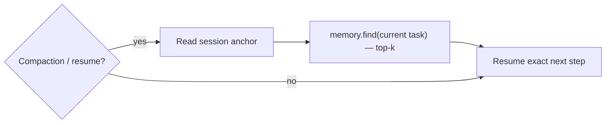

<!-- SPDX-License-Identifier: Apache-2.0 -->

# Self-Repair Across Auto-Compaction

Long agent sessions hit context auto-compaction: the host summarizes or truncates the context and
the agent can lose its place. Artesian makes this a non-event by combining a deterministic anchor
with targeted recall, so even switching agents mid-task (e.g. Claude Code → Codex) is lossless.

Three mechanisms:

1. **Session anchor (Anchor)** — a tiny, always-current record of the in-flight task, the active
   plan pointer, the last N decisions, and the next concrete step. Cheap to update every turn.
2. **Continuous externalization** — durable learnings are written to long-term memory as they
   occur, so truncation loses nothing recoverable via `memory.find`.
3. **Self-repair hook** — on a detected compaction/resume boundary the agent re-reads the anchor
   (deterministic — answers "what is my current step") and runs a targeted `memory.find`
   (semantic — restores surrounding knowledge) before its next action. No manual "re-read the
   docs" step.



## Status: IMPLEMENTED

| Component | Location | State |
|---|---|---|
| `AnchorAnchorStore` | `aquifer/src/anchor.rs` | Reads/writes anchor to OKF `log.md` |
| `recover_after_compaction` | `aquifer/src/anchor.rs` | Re-reads anchor + targeted `memory.find` |
| Anchor tests | `aquifer/tests/anchor.rs` | 2 passing integration tests |
| MCP tools | `artesian-mcp/src/lib.rs` | `memory.anchor.get`, `memory.anchor.set` |
| CLI commands | `artesian-cli/src/main.rs` | `artesian memory anchor get|set|recover` |

The host-specific compaction detector remains an integration concern — Artesian cannot intercept
the host's compaction signal, but the replay primitive (`recover_after_compaction`) is implemented
and tested. The canonical integration pattern:

```
# At loop start (or after any suspected compaction):
artesian memory anchor recover --limit 10
# → prints the last anchor + top-10 memory hits, ready to inject into the next prompt
```

This is a first-class, demoable feature: interrupt a loop at "turn 47," run `recover`, resume
with plan pointer, decisions, and next step intact — no human "re-read the markdown" step.
