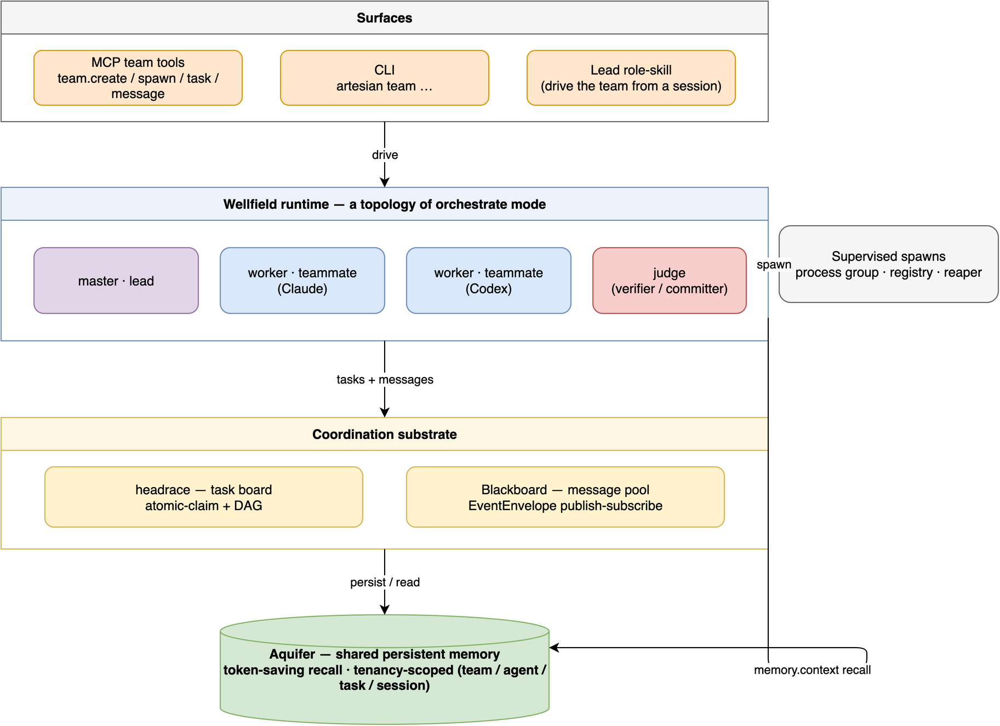

<!-- SPDX-License-Identifier: Apache-2.0 -->

# Agent Teams — Wellfield

A **Wellfield** (a cluster of wells drawing from one shared aquifer) is a vendor-neutral agent team: a **lead** plus
**teammates** (and an optional **judge**) that coordinate over a shared task board and a shared
message pool, all reading and writing **one shared persistent memory**. Teammates can be backed by
any agent and model — Claude, Codex, opencode, Gemini, a local model — and every teammate runs
**supervised**, so a team never leaks or orphans processes.

Wellfield is not a separate product or a rewrite. It composes primitives Artesian already has: the headrace
task board, the EventEnvelope message pool, the Basin role loop, supervised process spawning,
and Aquifer memory.



## Where it fits: a topology, not a new mode

Teams are a **topology of `orchestrate` / `full`**, not a fifth [mode](modes.md). A Wellfield is simply
`orchestrate` scaled from a single worker to several coordinating teammates — you opt in exactly as
you opt into orchestration, and `memory` mode is unaffected.

| Mode | Memory | Orchestration | Team topology |
|---|---|---|---|
| `memory` | yes | — | — |
| `orchestrate` | yes | master / worker / judge | single worker **or** a Wellfield |
| `full` | yes | + sandbox | single worker **or** a Wellfield |
| `advanced` | your store | bring-your-own | Artesian coordinates your agents |

## Roles: three archetypes, your own names

Artesian keeps a small, clear coordination grammar — three **archetypes** (kinds):

| Kind | Responsibility |
|---|---|
| `master` | the lead: plans, splits work, assigns/synthesizes |
| `worker` | a teammate that executes a bounded task |
| `judge` | verifies a result before it is accepted (sole committer) |

On top of that, **you define your own named specializations** — `security-reviewer`, `architect`,
`test-runner` — each mapping to one archetype. So you name roles in your own language while the
system keeps a predictable master/worker/judge structure underneath.

## Defining teammates — `.agent/agents/*.md`

Teammate roles are plain, vendor-neutral, git-versioned files — human-editable and diffable:

```markdown
---
name: security-reviewer
kind: worker                    # master | worker | judge
description: Reviews auth code for vulnerabilities.   # used for routing/selection
agent: codex                    # optional; else resolved from bindings/catalog
model: gpt-5.5                  # optional; a specific model
allow_tools: [read, grep, memory.find]   # optional tool scoping
---
You are a security reviewer. Focus on token handling, session management, and input
validation. Report findings with severity ratings. (appended to the teammate's system prompt)
```

- **Definitions are configuration, so they live in files** — version-controllable and shareable in
  the repo, not in the vector store. (Memory *records* and their tenancy metadata do live in the
  vector store payload, as usual — see [memory.md](memory.md). Definitions are not search objects.)
- Artesian also **reads existing `.claude/agents/*.md`** definitions, so you can reuse roles you have
  already written instead of redefining them. Interop reads `name`, `description`, `tools`,
  `model`, and the body prompt addendum; if no Artesian `kind` is present, Artesian infers the
  archetype from the name (`lead`/`master` -> `master`, `review`/`judge` -> `judge`, otherwise
  `worker`). Artesian does not copy vendor-reserved schema semantics.
- Optional: definitions can additionally be indexed for semantic "find a role that does X"
  discovery; the files remain the source of truth.
- `agents.list` includes both reachable agent/model entries and these role-definition summaries.
  Before spawn, a definition's resolved agent/model is validated against the catalog; unavailable
  bindings fail before any process starts.

## How a team works

- **Shared task board (headrace):** the lead creates tasks with dependencies (a DAG); teammates
  self-claim the next unblocked task (atomic file-lock claim) or the lead assigns explicitly;
  completing a task unblocks its dependents automatically. See [task-tracking.md](task-tracking.md).
- **Shared message pool / blackboard (EventEnvelope, publish-subscribe):** teammates post and read
  typed messages (`ASK`, `RESULT`, `REVIEW`, `DONE`); direct teammate-to-teammate addressing rides
  on the same pool.
- **Verifier + judge:** a result passes a verifier (the trust boundary) and an optional judge before
  it is accepted; the judge is the sole committer.
- **Optional plan approval:** teams or specific role definitions can require a pre-execution plan.
  In that case a task cannot be claimed until a `REVIEW` message with approval is posted by the
  judge or lead. This is off by default because reviewers can reject good work as well as catch bad
  plans.
- **Feedback-aware admission seam:** teams bound the number of admitted teammates. When the cap is
  reached, a teammate is paused instead of killed; current implementation reuses spawn caps and
  quotas, leaving room for adaptive AIMD-style admission later.
- **Lifecycle & safety:** every teammate spawns through the supervised process layer (own process
  group, persistent registry, startup reaper), so a teammate — and any child it spawns — is always
  cleaned up on completion, timeout, cancellation, or a crash. A team cannot fill the machine with
  orphans. See [concurrency.md](concurrency.md).

## Memory is the substrate (and the flagship)

Every teammate reads and writes **one shared persistent memory** (Aquifer), scoped by tenancy
(`team` / `agent` / `task` / `session`). So teammates share a working context **and** that context
survives across sessions and context compaction — the gap in current team systems, where teammates
do not inherit each other's history and nothing persists between runs. `memory.context` returns each
teammate just the slice it needs, which is where the token saving comes from
([benchmark](../benchmarks/README.md)).

## Integration depths — use as little or as much as you want

1. **Memory only (the flagship):** point your **existing** team / sub-agent / orchestrator system at
   Artesian's memory over MCP (`memory.find` / `memory.context` / `memory.store`). You add persistent,
   token-saving shared memory to whatever you already run — Claude agent-teams, a custom
   orchestrator, LangGraph — with no orchestration takeover.
2. **Coordination (`advanced`):** keep your own agents; use Artesian's shared task board and message
   pool as the coordination substrate.
3. **Full Wellfield:** Artesian runs the team end to end — vendor-neutral, verifier-gated, supervised.

Interop rule — **do not double-orchestrate.** When a native team system (e.g. Claude Code agent
teams) is driving the loop, run Artesian in `memory` / `advanced`, not `orchestrate`. Artesian's
orchestration tools are off outside `orchestrate` / `full`, so this is the default.

## Surfaces

- **MCP team tools:** `team.create`, `team.spawn`, `team.task.add` / `claim` / `complete`,
  `team.message`, `team.status`, `team.cleanup` — over the same supervised engine.
- **CLI:** `artesian team …` exposes the same operations for foreground/local use.
- **Lead role-skill:** a short instruction `artesian init` writes so an in-session lead drives the team
  natively (read the catalog, recall via `memory.context`, delegate, gate via the judge).

## Prior art and naming

Wellfield builds on established multi-agent patterns — MetaGPT's role-based publish-subscribe message
pool, OpenAI Symphony's single-authority dispatch, agent-teams-ai, and Claude Code's agent teams and
sub-agents. Artesian reuses ideas and credits them; it does not reproduce their code, specifications,
or marks. The `.agent/agents/*.md` schema and the hydro naming are Artesian's own.
